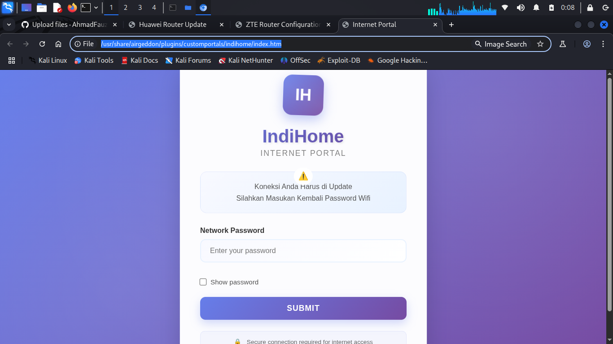

# 🌐 Koleksi Captive Portal

[](https://github.com/AhmadFauziAbdillah/Captive-Portal/stargazers)
[](https://github.com/AhmadFauziAbdillah/Captive-Portal/network)
[](LICENSE)

> Koleksi lengkap template captive portal untuk merek router populer Indonesia termasuk router Indihome, Huawei, dan ZTE.

## 📋 Daftar Isi

- [Gambaran Umum](#-gambaran-umum)
- [Template yang Tersedia](#-template-yang-tersedia)
- [Fitur](#-fitur)
- [Instalasi](#-instalasi)
- [Penggunaan](#-penggunaan)
- [Screenshot](#-screenshot)
- [Kontribusi](#-kontribusi)
- [Lisensi](#-lisensi)
- [Disclaimer](#-disclaimer)

## 🎯 Gambaran Umum

Repository ini berisi koleksi template captive portal yang dirancang khusus untuk penyedia layanan internet Indonesia dan produsen router. Template ini dibuat untuk tujuan edukasi dan penetration testing dalam lingkungan terkontrol.

**Captive Portal** adalah halaman web yang dilihat pengguna ketika mereka mencoba mengakses internet melalui jaringan nirkabel publik. Koleksi ini menyediakan template realistis yang meniru antarmuka login router populer.

## 🚀 Template yang Tersedia

### 1. 📡 Portal Indihome
- **Deskripsi**: Template captive portal untuk antarmuka router Indihome
- **File**: `indihome.png` (Preview)
- **Target**: Router Indihome/Telkom Indonesia
- **Fitur**: Desain otentik sesuai antarmuka resmi Indihome

### 2. 🔧 Portal Huawei  
- **Deskripsi**: Template captive portal untuk antarmuka router Huawei
- **File**: `huawei.png` (Preview)
- **Target**: Model router Huawei (HG8245H, HG8245A, dll.)
- **Fitur**: Desain antarmuka web router Huawei modern

### 3. ⚡ Portal ZTE
- **Deskripsi**: Template captive portal untuk antarmuka router ZTE
- **File**: `zte.png` (Preview)
- **Target**: Model router ZTE (F609, F660, dll.)
- **Fitur**: Antarmuka manajemen router ZTE yang bersih

## ✨ Fitur

- 🎨 **Desain Otentik** - Replika sempurna dari antarmuka router asli
- 📱 **Layout Responsif** - Bekerja lancar di desktop dan perangkat mobile
- 🔒 **Fokus Keamanan** - Dibuat untuk tujuan edukasi dan testing resmi
- 🌏 **Dioptimalkan untuk Indonesia** - Dirancang khusus untuk antarmuka ISP Indonesia
- 💻 **Mudah Deploy** - Proses setup dan konfigurasi sederhana
- 🔧 **Dapat Dikustomisasi** - Mudah dimodifikasi sesuai kebutuhan spesifik

## 📦 Instalasi

### Prasyarat
- Web server (Apache, Nginx, atau sejenisnya)
- Dukungan PHP (opsional, tergantung implementasi)
- Pengetahuan dasar teknologi web

### Mulai Cepat

1. **Clone repository**
   ```bash
   git clone https://github.com/AhmadFauziAbdillah/Captive-Portal.git
   cd Captive-Portal
   ```

2. **Setup web server**
   ```bash
   # Untuk Apache
   sudo cp -r * /var/www/html/captive-portal/
   
   # Untuk Nginx
   sudo cp -r * /usr/share/nginx/html/captive-portal/
   ```

3. **Konfigurasi permission**
   ```bash
   sudo chmod -R 755 /path/to/captive-portal/
   sudo chown -R www-data:www-data /path/to/captive-portal/
   ```

4. **Akses portal**
   Buka browser dan navigasi ke:
   ```
   http://ip-server-anda/captive-portal/
   ```

## 🖥️ Penggunaan

### Implementasi Dasar

1. Pilih template yang sesuai untuk router target Anda
2. Konfigurasi access point untuk redirect ke captive portal
3. Sesuaikan portal sesuai kebutuhan kasus penggunaan spesifik
4. Test portal dalam lingkungan terkontrol

### Konfigurasi Lanjutan

Untuk pengguna lanjutan, Anda dapat mengintegrasikan template ini dengan:
- **Serangan Evil Twin** (untuk penetration testing resmi)
- **Perangkat WiFi Pineapple**
- **Konfigurasi access point custom**
- **Assessment keamanan jaringan**

## 📸 Screenshot

### Portal Indihome

*Antarmuka login router Indihome otentik*

---

### Portal Huawei  

*Antarmuka manajemen router Huawei modern*

---

### Portal ZTE

*Portal konfigurasi router ZTE yang bersih*

### Panduan Kontribusi

- Pastikan template adalah replika pixel-perfect
- Test di berbagai perangkat dan browser
- Ikuti standar coding yang konsisten
- Update dokumentasi sesuai kebutuhan
- Hormati hak kekayaan intelektual

## 📄 Lisensi

Proyek ini dilisensikan di bawah MIT License - lihat file [LICENSE](LICENSE) untuk detail.

## ⚠️ Disclaimer

**PEMBERITAHUAN HUKUM PENTING**

Proyek ini dibuat untuk **tujuan edukasi semata** dan penetration testing resmi dalam lingkungan terkontrol.

### Panduan Penggunaan:
- ✅ **Testing resmi** pada jaringan Anda sendiri
- ✅ **Riset edukasi** dan pembelajaran
- ✅ **Assessment keamanan** dengan otorisasi yang tepat
- ❌ **Akses tidak sah** ke jaringan yang bukan milik Anda
- ❌ **Aktivitas jahat** atau penggunaan ilegal
- ❌ **Pelanggaran privasi** atau terms of service

### Tanggung Jawab Hukum:
Penulis dan kontributor proyek ini **TIDAK bertanggung jawab** atas penyalahgunaan software ini. Pengguna bertanggung jawab penuh untuk memastikan penggunaan mereka mematuhi hukum dan regulasi yang berlaku di yurisdiksi mereka.

Dengan menggunakan software ini, Anda setuju untuk menggunakannya secara bertanggung jawab dan etis.

---

## 📞 Dukungan & Kontak

📱  [Instagram](https://www.instagram.com/faujiabdilah_/)

---

<div align="center">

</div>
