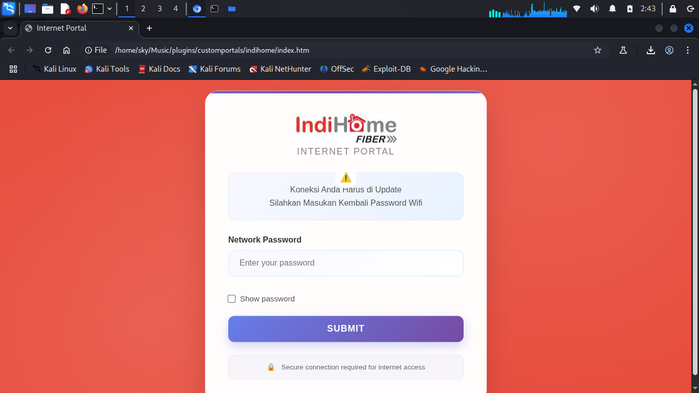
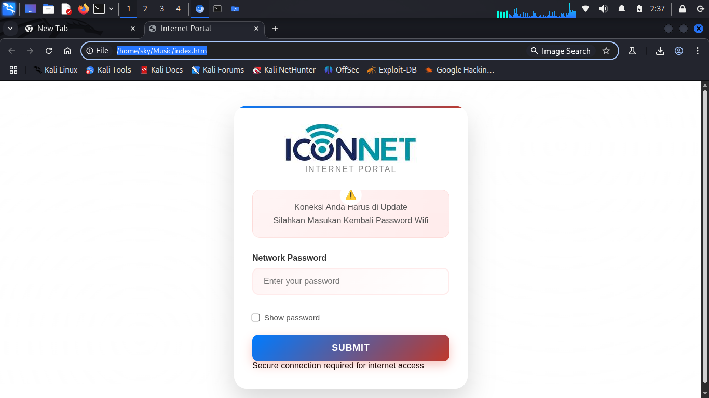
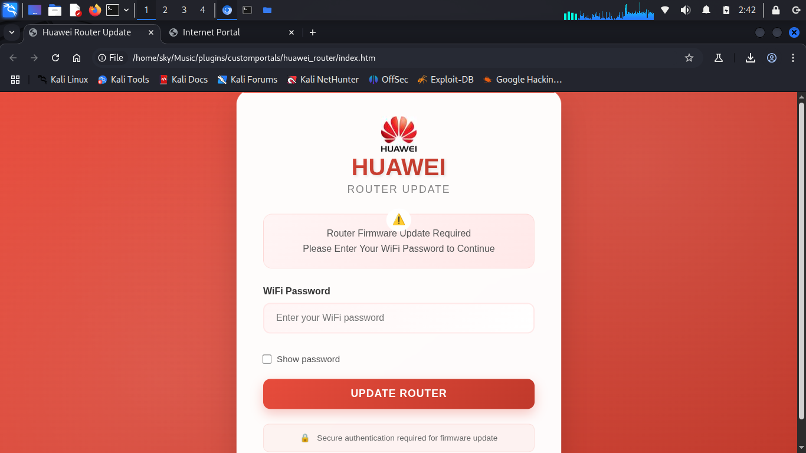
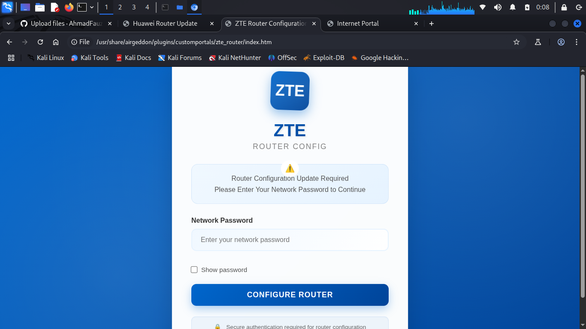

# 🌐 Koleksi Captive Portal

## 📸 Screenshot

### Portal Indihome

*Antarmuka login router Indihome otentik*

---

### Portal Indihome

*Antarmuka login router Iconnet*

---

### Portal Huawei  

*Antarmuka manajemen router Huawei modern*

---

### Portal ZTE

*Portal konfigurasi router ZTE yang bersih*

## ⚠️ Disclaimer

**PEMBERITAHUAN HUKUM PENTING**

Proyek ini dibuat untuk **tujuan edukasi semata** dan penetration testing resmi dalam lingkungan terkontrol.

### Panduan Penggunaan:
- ✅ **Testing resmi** pada jaringan Anda sendiri
- ✅ **Riset edukasi** dan pembelajaran
- ✅ **Assessment keamanan** dengan otorisasi yang tepat
- ❌ **Akses tidak sah** ke jaringan yang bukan milik Anda
- ❌ **Aktivitas jahat** atau penggunaan ilegal
- ❌ **Pelanggaran privasi** atau terms of service

### Tanggung Jawab Hukum:
Penulis dan kontributor proyek ini **TIDAK bertanggung jawab** atas penyalahgunaan software ini. Pengguna bertanggung jawab penuh untuk memastikan penggunaan mereka mematuhi hukum dan regulasi yang berlaku di yurisdiksi mereka.

Dengan menggunakan software ini, Anda setuju untuk menggunakannya secara bertanggung jawab dan etis.

---

## 📞 Dukungan & Kontak

📱  [Instagram](https://www.instagram.com/faujiabdilah_/)

---

